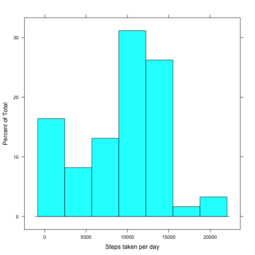
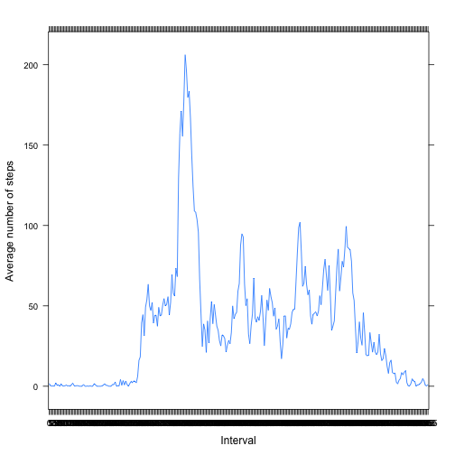
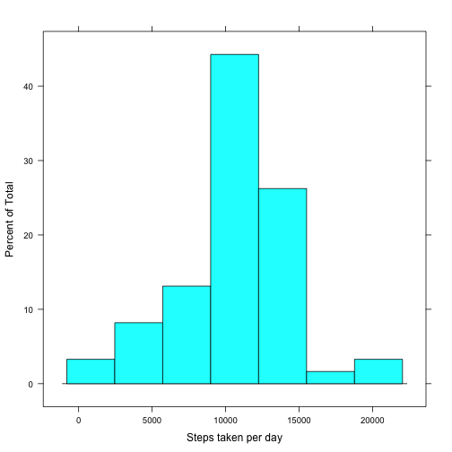
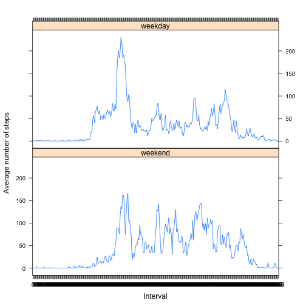

# Reproducible Research: Peer Assessment 1


## Loading and preprocessing the data

```r
data <- read.csv("activity.csv")  # make sure the data file is in your working directory
data$date <- as.character(data$date)  # transform the data type of variable 'date' and 'interval'
data$date <- as.Date(data$date)
data$interval <- as.factor(data$interval)
```


## What is mean total number of steps taken per day?

```r
dates <- seq(from = min(data$date), to = max(data$date), by = 1)
# Calculate the total number of steps taken per day
steps.per.day <- data.frame()
for (date in dates) {
    steps.per.day <- rbind(steps.per.day, data.frame(steps = sum(data[data$date == 
        date, ]$steps, na.rm = TRUE)))
}
# Make a histogram of the total number of steps taken each day
library("lattice")
histogram(~steps, data = steps.per.day, xlab = "Steps taken per day")
```

 

```r
mean <- mean(steps.per.day$steps)  # calculate the mean
median <- median(steps.per.day$steps)  # calculate the median
```

The mean and median total number of steps taken per day is 9354.2295 and 10395.

## What is the average daily activity pattern?

```r
library(reshape2)
remove(mean)  # remove the variable 'mean' in order to use dcast function
data.melting <- melt(data, id = c("interval"), measure.vars = c("steps"), na.rm = TRUE)
data.casting <- dcast(data.melting, interval ~ variable, mean)
xyplot(steps ~ interval, data = data.casting, type = "l", ylab = "Average number of steps", 
    xlab = "Interval")
```

 

```r
# Get the interval containing the maximum number of steps
interval.max <- data.casting[data.casting$steps == max(data.casting$steps), 
    ]$interval
```

The interval 835 contains the maximum number of steps, which is about 206.1698

## Imputing missing values
The strategy dealing with missing values is to fill in all of the missing values with the mean for that 5-minute interval

```r
counts.missing <- sum(is.na(data))  # calculate the total number of missing values
index.missing <- which(is.na(data))
# Create a new data set and fill in all of the missing values with the mean
# for that 5-minute interval
data.new <- data
for (index in index.missing) {
    interval <- data.new[index, ]$interval
    data.new[index, ]$steps <- data.casting[data.casting$interval == interval, 
        ]$steps
}
# Make a histogram of the total number of steps taken each day using the new
# dataset
steps.per.day.new <- data.frame()
for (date in dates) {
    steps.per.day.new <- rbind(steps.per.day.new, data.frame(steps = sum(data.new[data.new$date == 
        date, ]$steps)))
}
histogram(~steps, data = steps.per.day.new, xlab = "Steps taken per day")
```

 

```r
mean.new <- mean(steps.per.day.new$steps)  # calculate the new mean
median.new <- median(steps.per.day.new$steps)  # calculate the new median
```

The total number of missing values in the dataset is 2304.  
The new mean and median total number of steps taken per day is 1.0766 &times; 10<sup>4</sup> and 1.0766 &times; 10<sup>4</sup>.  
We can see that the new mean and median values are both larger for we replace the missing values with the positive average 5-minite interval value.

## The differences between weekday and weekend activity pattern

```r
# Create a new factor variable called 'weekday' to indicate whether a given
# date is a weekday or weekend day.
weekdays <- c("Monday", "Tuesday", "Wednesday", "Thursday", "Friday")
weekday <- numeric()
for (i in 1:nrow(data.new)) {
    weekday <- c(weekday, ifelse(weekdays(data.new[i, ]$date) %in% weekdays, 
        1, 0))
}
weekday <- as.factor(weekday)
levels(weekday) <- c("weekend", "weekday")
# Add this factor varialbe to the dataset.
data.new <- cbind(data.new, weekday)
# Make a panel plot containing a time series plot of the 5-minute interval
# and the average number of steps taken, averaged across all weekday days or
# weekend days.
remove(mean)  # remove the variable 'mean' in order to use dcast function
data.new.melting <- melt(data.new, id = c("interval", "weekday"), measure.vars = c("steps"))
data.new.casting <- dcast(data.new.melting, interval + weekday ~ variable, mean)
xyplot(steps ~ interval | weekday, data = data.new.casting, type = "l", ylab = "Average number of steps", 
    xlab = "Interval", layout = c(1, 2))
```

 

